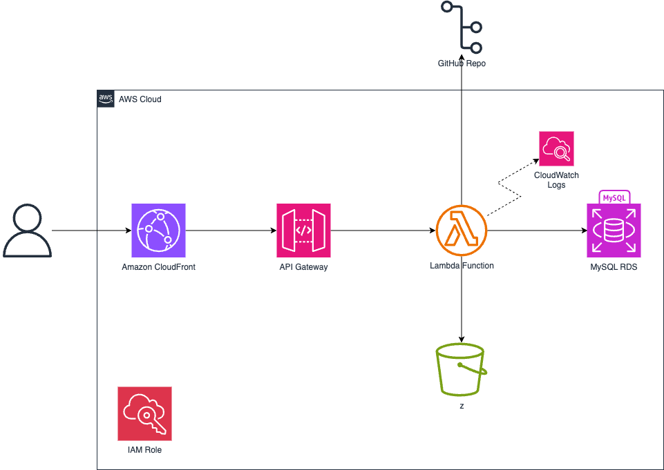

# Bus Listings Scraper

This project implements a technical solution to scrape, process, and integrate detailed school bus listings into a structured database. It adheres to industry best practices for scalability, accuracy, and reusability. Built to evaluate advanced skills in web scraping, ETL pipelines, and database operations, this solution leverages a robust AWS-based architecture.

---

## Objective 🎯

The goal of this project is to:
- Scrape comprehensive data from [Central States Bus Inventory](https://www.centralstatesbus.com/inventory/bus-for-sale/).
- Process the data into predefined schemas using efficient ETL pipelines.
- Store and manage the data in AWS RDS MySQL and AWS S3.

This solution demonstrates expertise in:
1. Advanced web scraping.
2. Data processing pipelines.
3. AWS-based service integration.
4. Scalability and error handling.

---

## System Overview 🛠️

### Core Features
1. **Web Scraping**:
   - Extracts detailed information, including title, year, make, model, mileage, pricing, and images.
   - Handles data cleaning and transformation.
   - Ensures uniqueness and consistency.

2. **ETL Pipeline**:
   - Orchestrated through AWS Lambda.
   - Transforms raw data into JSON-ready format for storage and further integration.

3. **Database Integration**:
   - Maps processed data to MySQL schemas with validations.
   - Includes three core tables:
     - **buses**: Core bus information.
     - **buses_overview**: Detailed descriptions and specifications.
     - **buses_images**: Image metadata.

4. **AWS Integration**:
   - **AWS Lambda**: Executes the scraper and ETL process.
   - **AWS S3**: Stores intermediate and processed data.
   - **AWS RDS (MySQL)**: Manages structured data.
   - **CloudWatch**: Provides monitoring and logs.

---

## Architecture Diagram 🖼️

Below is the visual representation of the AWS-based architecture:



### Explanation of the Architecture

#### **AWS Lambda (school-bus-scraper-dev-scraper)**
- Serves as the core of the project, executing the Python code for web scraping.
- Orchestrates the ETL pipeline, transforming the scraped data and integrating it into downstream services.
- Deployed using the Serverless Framework (`serverless deploy --verbose`).
- Triggered by API Gateway for HTTP requests.
- Sends logs to CloudWatch Logs for monitoring and debugging.

#### **Amazon API Gateway**
- Acts as the HTTP entry point for invoking the Lambda function.
- Configured to handle HTTP POST requests at the `/run-scraper` route.
- Operates asynchronously to ensure requests do not time out during long-running tasks.

#### **Amazon S3 (bus-scraper-data)**
- Stores the JSON output generated by the ETL pipeline.
- Configured with appropriate bucket policies to allow secure access from the Lambda function.

#### **Amazon RDS (bus-scraper-db)**
- Hosts a MySQL database to store structured data processed by the ETL pipeline.
- Receives detailed bus listings, overviews, and image metadata.
- Endpoint: `bus-scraper-db.cl6ayu0capj6.us-east-1.rds.amazonaws.com`.

#### **AWS CloudWatch**
- Collects logs from the Lambda function for real-time monitoring and troubleshooting.
- Automatically configured by the Lambda environment.

---

## Project Structure

```
project/
|-- config/
|   |-- settings.py        # Environment variable configurations
|-- src/
|   |-- scraper/
|   |   |-- models.py      # Pydantic models for scraping
|   |   |-- main_scraper.py # Core scraper logic
|   |   |-- utils.py       # Utility functions
|   |-- database/
|   |   |-- models.py      # SQLAlchemy ORM models
|   |   |-- db_manager.py  # Database operations
|   |   |-- etl.py         # ETL pipeline implementation
|   |   |-- connection.py  # Database connection setup
|-- requirements.txt       # Python dependencies
|-- handler.py             # AWS Lambda handler
|-- serverless.yml         # Serverless framework configuration
```

---

### Key Technical Highlights
- **Concurrency**: Supports simultaneous scraping of multiple pages.
- **Scalability**: Designed to handle large datasets efficiently.
- **Error Handling**: Implements retry mechanisms and logging via CloudWatch.
- **Modular Design**: Separation of concerns across scraper, ETL, and database layers.

---

## Getting Started 🚀

Follow these steps to set up and execute the project.

### Prerequisites 🗃️
- Python 3.9+
- [AWS CLI](https://aws.amazon.com/cli/) configured with sufficient permissions.
- [Serverless Framework](https://www.serverless.com/) installed globally.

Ensure your AWS environment is correctly set up:
```bash
aws configure
```

---

### Installation 🔧

1. Clone the repository:
```bash
git clone https://github.com/your-username/school-bus-scraper.git
cd school-bus-scraper
```

2. Install project dependencies:
```bash
pip install -r requirements.txt
```

3. Configure environment variables:
   - Create a `.env` file with the following keys:
     - `DB_HOST`
     - `DB_PORT`
     - `DB_NAME`
     - `DB_USER`
     - `DB_PASSWORD`
     - `S3_BUCKET_NAME`
     - `AWS_REGION`

4. Test the scraper locally:
```bash
python handler.py
```

---

## Testing ⚙️

### Unit Testing 🔩

Run the suite of unit tests to validate individual components:
```bash
pytest tests/
```

Example:
```bash
pytest tests/test_scraper.py
```

### Code Style Checks ⌨️

Ensure adherence to PEP 8 standards:
```bash
flake8 src/
```

---

## Deployment 📦

### Steps to Deploy
1. Package and deploy the solution using Serverless Framework:
```bash
serverless deploy
```

2. This command provisions the following AWS resources:
   - **AWS Lambda** function for ETL execution.
   - **AWS S3** bucket for data storage.
   - **AWS RDS MySQL** instance for structured data.

---

## Challenge-Specific Requirements 🗒️

### Data Requirements
- Scrapes the following attributes:
  - Title, year, make, model, mileage, passengers, engine details, price, and VIN.
  - Key descriptions and features.
  - Image metadata, including URL and index.

### Database Schema
- Adheres to the provided MySQL schemas:
  - **buses**: Stores core bus details.
  - **buses_overview**: Contains detailed descriptions and specifications.
  - **buses_images**: Tracks image metadata.

### Error Handling
- Implements retry logic for failed scraping attempts.
- Prevents duplicate entries using unique constraints.

---

## Built With 🛠️

- **Python** - Core language.
- **BeautifulSoup** - HTML parsing and scraping.
- **SQLAlchemy** - ORM for database interaction.
- **AWS Services** - Lambda, S3, RDS, CloudWatch.
- **Serverless Framework** - Deployment and orchestration.
- **Pytest** - Testing framework.
- **Flake8** - Linter for code style compliance.

---

## Author ✍️

**Luis Aaron Goicochea Alfaro**  
*Data Developer*  
[GitHub Profile](https://github.com/LuisAaronGoicochea)

---

## Additional Notes 🎁

- For challenge evaluators: The project adheres strictly to the requirements outlined in the provided PDF documentation.
